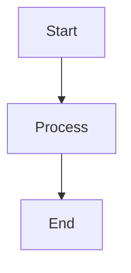

# @tomaszjarosz/react-markdown

Complete markdown rendering components for React - typography, code blocks with syntax highlighting, callouts, diagrams, and renderer utilities.

**Zero Tailwind dependency** - uses pure CSS with BEM naming convention.

## Features

- **Typography** - Headings with anchor links, lists, tables, blockquotes, inline formatting
- **Code Blocks** - Syntax highlighting (40+ languages), line highlighting, smart collapsing, copy button
- **Callouts** - Info, warning, error, success, tip, note, example, problem, solution
- **Diagrams** - Mermaid flowcharts/sequence/class diagrams, Flow diagrams with arrows
- **Media** - Smart links (internal/external detection), images with lazy loading
- **Utilities** - Factory for react-markdown components, heading ID generation, line highlight parsing

## Installation

```bash
npm install @tomaszjarosz/react-markdown
# or
bun add @tomaszjarosz/react-markdown
```

## Requirements

- React 17+ or 18+
- Import CSS styles (see below)

## Quick Start

### 1. Import Styles

```tsx
// In your app entry point (e.g., main.tsx or App.tsx)
import '@tomaszjarosz/react-markdown/styles.css';
```

### 2. Use with react-markdown

```tsx
import ReactMarkdown from 'react-markdown';
import remarkGfm from 'remark-gfm';
import {
  createMarkdownComponents,
  createHeadingIdGenerator,
  defaultDetectCallout,
} from '@tomaszjarosz/react-markdown';

function ArticleContent({ content }: { content: string }) {
  const components = createMarkdownComponents({
    generateHeadingId: createHeadingIdGenerator(),
    detectCallout: defaultDetectCallout,
  });

  return (
    <ReactMarkdown remarkPlugins={[remarkGfm]} components={components}>
      {content}
    </ReactMarkdown>
  );
}
```

### 3. Or Use Individual Components

```tsx
import { H1, CodeBlockWithLanguage, Callout } from '@tomaszjarosz/react-markdown';

function MyComponent() {
  return (
    <>
      <H1 id="title">Hello World</H1>
      <CodeBlockWithLanguage language="javascript" code="console.log('hi');" />
      <Callout type="info">This is informational.</Callout>
    </>
  );
}
```

---

## Components Reference

### Typography

#### Headings (H1-H6)

```tsx
import { H1, H2, H3, H4, H5, H6 } from '@tomaszjarosz/react-markdown';

<H1 id="introduction">Introduction</H1>
<H2 id="getting-started">Getting Started</H2>
```

**Features:**
- Clickable anchor links (hover to reveal, click to copy URL)
- Proper scroll margins for sticky header navigation
- Semantic HTML with customizable IDs

#### Lists

```tsx
import { UnorderedList, OrderedList, ListItem } from '@tomaszjarosz/react-markdown';

<UnorderedList>
  <ListItem>First item</ListItem>
  <ListItem>Second item</ListItem>
</UnorderedList>

<OrderedList>
  <ListItem>Step one</ListItem>
  <ListItem>Step two</ListItem>
</OrderedList>
```

#### Tables

```tsx
import { Table, TableHead, TableBody, TableRow, TableHeader, TableCell } from '@tomaszjarosz/react-markdown';

<Table>
  <TableHead>
    <TableRow>
      <TableHeader>Name</TableHeader>
      <TableHeader>Value</TableHeader>
    </TableRow>
  </TableHead>
  <TableBody>
    <TableRow>
      <TableCell>Item 1</TableCell>
      <TableCell>100</TableCell>
    </TableRow>
  </TableBody>
</Table>
```

#### Inline Elements

```tsx
import { Strong, Emphasis, Strikethrough, HorizontalRule } from '@tomaszjarosz/react-markdown';

<Strong>Bold text</Strong>
<Emphasis>Italic text</Emphasis>
<Strikethrough>Deleted text</Strikethrough>
<HorizontalRule />
```

#### Blockquote

```tsx
import { BlockquoteComponent } from '@tomaszjarosz/react-markdown';

<BlockquoteComponent>
  "The best way to predict the future is to invent it."
</BlockquoteComponent>
```

---

### Code Blocks

```tsx
import {
  CodeBlockWithLanguage,
  SimpleCodeBlock,
  InlineCode,
  CopyCodeButton
} from '@tomaszjarosz/react-markdown';

// Full-featured code block with syntax highlighting
<CodeBlockWithLanguage
  language="typescript"
  code={`function hello(): string {
  return "world";
}`}
  highlightLines={[2]}  // Highlight line 2
/>

// Simple code block without syntax highlighting
<SimpleCodeBlock code="npm install package-name">
  npm install package-name
</SimpleCodeBlock>

// Inline code
<InlineCode>const x = 1</InlineCode>
```

**Features:**
- Syntax highlighting for 40+ languages (via Prism)
- Line highlighting with `{1,3-5}` syntax in markdown
- Smart collapsing for long code blocks (39+ lines) with expand/collapse
- Copy to clipboard button
- Diff mode support (`diff-javascript`, `diff-typescript`, etc.)
- Language badge with icons

**Supported Languages:**
`javascript`, `typescript`, `jsx`, `tsx`, `java`, `python`, `go`, `rust`, `c`, `cpp`, `csharp`, `sql`, `bash`, `shell`, `json`, `yaml`, `xml`, `html`, `css`, `scss`, `markdown`, `graphql`, `docker`, `kotlin`, `swift`, `ruby`, `php`, `perl`, `lua`, `r`, `scala`, `haskell`, `elixir`, `clojure`, `erlang`, `ocaml`, `fsharp`, `powershell`, `vim`, `nginx`, `toml`, `ini`, and more.

---

### Callouts

```tsx
import { Callout } from '@tomaszjarosz/react-markdown';

<Callout type="info" title="Information">
  This is an info callout.
</Callout>

<Callout type="warning" title="Warning">
  Be careful with this operation.
</Callout>

<Callout type="success">
  Operation completed successfully!
</Callout>

<Callout type="error" title="Error">
  Something went wrong.
</Callout>

<Callout type="tip">
  Here's a helpful tip.
</Callout>
```

**Available types:**

| Type | Use Case | Icon |
|------|----------|------|
| `info` | General information | ℹ️ |
| `warning` | Warnings, cautions | ⚠️ |
| `error` | Errors, critical issues | ❌ |
| `success` | Success messages | ✅ |
| `note` | Notes, remarks | 📝 |
| `tip` | Tips, suggestions | 💡 |
| `example` | Code examples, demonstrations | 📋 |
| `problem` | Problem statements | ❓ |
| `solution` | Solutions to problems | ✔️ |

**Markdown Syntax:**
```markdown
> **Info:** This will become an info callout.
> **Warning:** This will become a warning callout.
> **Tip:** This will become a tip callout.
```

---

### Diagrams

#### Mermaid Diagrams

```tsx
import { MermaidDiagram } from '@tomaszjarosz/react-markdown';

<MermaidDiagram
  chart={`
    flowchart LR
      A[Start] --> B{Decision}
      B -->|Yes| C[OK]
      B -->|No| D[Cancel]
  `}
/>
```

**Features:**
- Lazy loading (Mermaid library loaded on demand)
- XSS protection with DOMPurify
- Responsive SVG output
- Error handling with source code preview
- Supports: flowcharts, sequence diagrams, class diagrams, state diagrams, ER diagrams, Gantt charts

**Markdown Syntax:**
````markdown

````

#### Flow Diagrams

Simple arrow-based diagrams for architecture visualization:

```tsx
import { FlowDiagram } from '@tomaszjarosz/react-markdown';

<FlowDiagram>
  Client → API Gateway → Service → Database
</FlowDiagram>
```

**Features:**
- Converts text arrows (`→`, `←`) to styled SVG arrows
- Clean, minimalist design
- Great for showing data flow, request paths, pipelines

**Markdown Syntax:**
When using with react-markdown, plain text with arrows is auto-detected:
```
Client → Load Balancer → Server
Request → Validation → Processing → Response
```

---

### Media

#### Links

```tsx
import { LinkComponent } from '@tomaszjarosz/react-markdown';

<LinkComponent href="https://example.com">External Link</LinkComponent>
<LinkComponent href="/blog/article">Internal Link</LinkComponent>
<LinkComponent href="#section">Anchor Link</LinkComponent>
```

**Features:**
- Automatic external link detection (adds `target="_blank"` and `rel="noopener noreferrer"`)
- Configurable internal link patterns
- Anchor link support

#### Images

```tsx
import { ImageComponent } from '@tomaszjarosz/react-markdown';

<ImageComponent
  src="/images/photo.jpg"
  alt="A beautiful sunset"
/>
```

**Features:**
- Lazy loading with Intersection Observer
- Loading skeleton placeholder
- Error state with fallback icon
- Responsive sizing

---

### Paragraph

```tsx
import { ParagraphComponent, defaultDetectCallout } from '@tomaszjarosz/react-markdown';

<ParagraphComponent detectCallout={defaultDetectCallout}>
  Regular paragraph text.
</ParagraphComponent>
```

**Features:**
- Automatic callout detection from markdown patterns
- Handles block-level elements correctly
- Special formatting for checkmark items (✓)

---

## Renderer Utilities

### createMarkdownComponents

Factory function that creates a complete component mapping for react-markdown:

```tsx
import {
  createMarkdownComponents,
  createHeadingIdGenerator,
  defaultDetectCallout,
} from '@tomaszjarosz/react-markdown';

const components = createMarkdownComponents({
  // Required: generates unique IDs for headings
  generateHeadingId: createHeadingIdGenerator(),

  // Required: detects callout patterns in paragraphs
  detectCallout: defaultDetectCallout,

  // Optional: custom styles for code blocks based on content width
  contentOptimizedStyle: (type) => ({}),

  // Optional: override the default code component
  codeComponent: MyCustomCodeComponent,

  // Optional: patterns to identify internal links (default: ['#'])
  internalLinkPatterns: ['/blog/', '/docs/', '#'],
});
```

### Heading ID Generation

```tsx
import { createHeadingIdGenerator, generateHeadingId } from '@tomaszjarosz/react-markdown';

// For documents with potentially duplicate headings
const generator = createHeadingIdGenerator();
generator('Introduction');     // → 'introduction'
generator('Introduction');     // → 'introduction-1'
generator('Getting Started');  // → 'getting-started'

// Simple one-off generation (no duplicate tracking)
generateHeadingId('Getting Started'); // → 'getting-started'
generateHeadingId('FAQ & Help');      // → 'faq-help'
```

### Line Highlight Parsing

```tsx
import { parseHighlightLines, extractLanguage } from '@tomaszjarosz/react-markdown';

// Parse highlight specification from className
parseHighlightLines('language-javascript{1,3-5,10}');
// → [1, 3, 4, 5, 10]

// Extract language from className
extractLanguage('language-typescript');
// → 'typescript'
```

---

## CSS Customization

The library uses CSS custom properties for theming. Override these in your CSS:

```css
:root {
  /* Spacing */
  --rm-spacing-xs: 0.25rem;
  --rm-spacing-sm: 0.5rem;
  --rm-spacing-md: 0.75rem;
  --rm-spacing-lg: 1rem;
  --rm-spacing-xl: 1.5rem;

  /* Border radius */
  --rm-radius-sm: 0.25rem;
  --rm-radius-md: 0.5rem;
  --rm-radius-lg: 0.75rem;

  /* Fonts */
  --rm-font-mono: ui-monospace, 'Cascadia Code', 'Source Code Pro', Menlo, Consolas, monospace;
  --rm-font-sans: system-ui, -apple-system, sans-serif;

  /* Colors (example overrides) */
  --rm-code-bg: #1e1e1e;
  --rm-code-text: #d4d4d4;
  --rm-callout-info-bg: #eff6ff;
  --rm-callout-info-border: #3b82f6;
}
```

All components use BEM naming with `rm-` prefix (e.g., `.rm-code-block`, `.rm-callout`, `.rm-heading`).

---

## Complete Exports

```tsx
import {
  // Code
  CodeBlockWithLanguage,
  CodeBlockHeader,
  SimpleCodeBlock,
  InlineCode,
  CopyCodeButton,
  LazyCodeHighlighter,
  LazyCodeHighlighterWrapper,

  // Callouts
  Callout,

  // Diagrams
  MermaidDiagram,
  FlowDiagram,

  // Typography - Headings
  H1, H2, H3, H4, H5, H6,

  // Typography - Lists
  UnorderedList, OrderedList, ListItem,

  // Typography - Tables
  Table, TableHeader, TableCell, TableRow, TableHead, TableBody,

  // Typography - Other
  BlockquoteComponent,
  Strong, Emphasis, HorizontalRule, Strikethrough,

  // Paragraph
  ParagraphComponent,
  extractText,
  getParagraphType,
  defaultDetectCallout,

  // Media
  LinkComponent,
  ImageComponent,

  // Renderer utilities
  createMarkdownComponents,
  createHeadingIdGenerator,
  generateHeadingId,
  parseHighlightLines,
  extractLanguage,

  // Types
  type HeadingProps,
  type ListProps,
  type TableProps,
  type CellProps,
  type BlockquoteProps,
  type InlineProps,
  type ParagraphProps,
  type LinkProps,
  type ImageProps,
  type FlowDiagramProps,
  type CalloutType,
  type CalloutResult,
  type DetectCallout,
  type MarkdownComponentProps,
  type MarkdownComponentPropsWithExtras,
  type MarkdownComponents,
  type CreateMarkdownComponentsOptions,
  type CreateMarkdownComponentsParams,
  type CodeComponentProps,
  type GenerateHeadingId,
  type GetContentOptimizedStyle,
} from '@tomaszjarosz/react-markdown';
```

---

## Usage Examples

### Blog Article Renderer

```tsx
import React, { useMemo } from 'react';
import ReactMarkdown from 'react-markdown';
import remarkGfm from 'remark-gfm';
import remarkEmoji from 'remark-emoji';
import rehypeRaw from 'rehype-raw';
import {
  createMarkdownComponents,
  createHeadingIdGenerator,
  defaultDetectCallout,
} from '@tomaszjarosz/react-markdown';
import '@tomaszjarosz/react-markdown/styles.css';

interface ArticleProps {
  content: string;
}

export function Article({ content }: ArticleProps) {
  const components = useMemo(
    () =>
      createMarkdownComponents({
        generateHeadingId: createHeadingIdGenerator(),
        detectCallout: defaultDetectCallout,
        internalLinkPatterns: ['/blog/', '/docs/', '#'],
      }),
    []
  );

  return (
    <article className="prose">
      <ReactMarkdown
        remarkPlugins={[remarkGfm, remarkEmoji]}
        rehypePlugins={[rehypeRaw]}
        components={components}
      >
        {content}
      </ReactMarkdown>
    </article>
  );
}
```

### Custom Code Component (with Visualizers)

```tsx
import {
  CodeBlockWithLanguage,
  InlineCode,
  parseHighlightLines,
  FlowDiagram,
  MermaidDiagram,
} from '@tomaszjarosz/react-markdown';
import { MyCustomVisualizer } from './visualizers';

export function CustomCodeComponent({ inline, className, children, ...props }) {
  const match = /language-([\w-]+)/.exec(className || '');
  const language = match ? match[1] : '';
  const code = String(children).replace(/\n$/, '');

  // Handle custom visualizer
  if (language === 'my-visualizer') {
    return <MyCustomVisualizer config={code} />;
  }

  // Handle mermaid
  if (language === 'mermaid') {
    return <MermaidDiagram chart={code} />;
  }

  // Handle inline code
  if (inline) {
    return <InlineCode {...props}>{children}</InlineCode>;
  }

  // Default code block
  return (
    <CodeBlockWithLanguage
      language={language}
      code={code}
      highlightLines={parseHighlightLines(className)}
    />
  );
}
```

---

## Browser Support

- Chrome/Edge 88+
- Firefox 78+
- Safari 14+

---

## Peer Dependencies

- `react` >= 17.0.0
- `react-dom` >= 17.0.0

---

## License

MIT © Tomasz Jarosz
